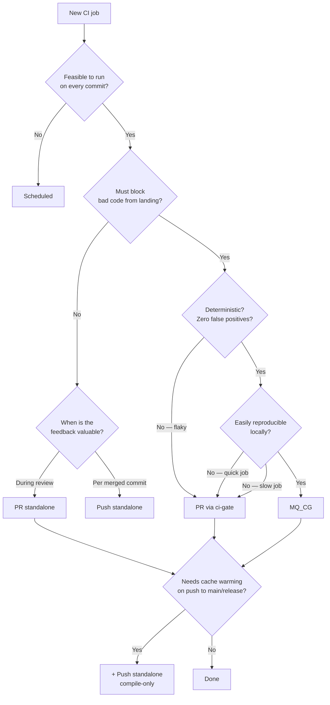

# Erigon — Repo Hygiene & CI Patterns

Source: `.claude/repo-references/clients/erigon/` (vendored full clone, verified genuine —
a real `git clone` with a populated `.git/` directory and working `git log` history, not a
summary or partial checkout). Every claim below cites a specific file and, where read in
full, an exact line number; where a workflow was sampled rather than read end-to-end, the
citation says so explicitly rather than inventing a line number.

Erigon is a production Go Ethereum execution client maintained by Erigon Technologies (the
`erigontech` GitHub org), with a small named set of module owners (`.github/CODEOWNERS`)
and a genuinely large, mature CI surface — over 70 workflow files, a second CI system
(Buildkite) running alongside GitHub Actions, and a written CI-placement policy
(`CI-GUIDELINES.md`) that most of the clients surveyed in this research series do not have.
Its repo-hygiene layer is asymmetric: extremely deep on CI governance and observability,
essentially absent on security-disclosure policy and PR templating. This document catalogs
both halves exhaustively and cross-references them against fukuii's current state.

---

## SECURITY.md — confirmed absent

A repo-wide search for `SECURITY.md` at root, inside `.github/`, and anywhere else in the
tree returns **zero hits**. Erigon has no GitHub-native security-disclosure policy file —
no private-advisory pointer, no security email, no acknowledgment SLA.

**What exists instead is operational-hardening documentation, not a disclosure policy.**
`docs/site/docs/fundamentals/security.md` (64 lines, read in full) is confirmed to be a
guide for node *operators* on hardening a running Erigon instance, not a channel for
*reporting a vulnerability in Erigon's own code*. Its frontmatter states the scope directly
(`security.md:3`): "Firewall rules, API exposure best practices, and hardening
recommendations." The body is organized into four operator-facing sections:

- **Network Security** (`security.md:11-28`) — a firewall table for ports `30303` (P2P,
  allow), `8545` (JSON-RPC, block except trusted machines), `9090` (private API, internal
  only), plus a CORS-hardening note ("Avoid using a wildcard `*` for Cross-Origin Resource
  Sharing (CORS) domains").
- **API Security** (`security.md:30-49`) — a table of four RPC-hardening measures: method
  allowlisting via `--rpc.accessList=rules.json`, removing `admin`/`debug` from
  `--http.api` on public nodes, rate limiting via `--rpc.max.concurrency`/
  `--rpc.batch.concurrency`/`--rpc.batch.limit`, and WebSocket subscription filters (noted
  as "disabled by default because they increase the risk of OOM issues"). A recommendation
  to place a reverse proxy in front of any publicly exposed RPC endpoint for
  application-level filtering, rate limiting, TLS termination, and WAF protection follows
  (`security.md:41-49`).
- **TLS and Authentication** (`security.md:51-59`) — CA/cert generation steps for securing
  RPC Daemon ↔ Erigon private-API communication.
- **Operational Security** (`security.md:61-64`) — run as a dedicated non-root user;
  configure `HTTPVirtualHosts` to prevent DNS-rebinding attacks via Host-header validation.

This file is also versioned — an older copy lives at
`docs/site/versioned_docs/version-v3.3/fundamentals/security.md` (69 lines), differing only
in wording (`RPC Daemon` → `RPC daemon`) and `sidebar_position` (11 vs. 16), confirming it
is treated as ordinary user-facing documentation subject to Docusaurus's normal
per-release versioning, not a governance artifact.

**Confirmed distinction:** nothing in this file, or anywhere else Erigon's repo, tells a
security researcher how to report a vulnerability they found *in Erigon's source code*
(e.g., a consensus bug, a memory-safety issue, a DoS in the P2P layer). The prior pass's
finding — "no SECURITY.md, and the one file that looks security-adjacent is actually an
operator hardening guide" — is accurate on direct read.

**Fukuii verdict:** fukuii also has no `SECURITY.md` (confirmed this session). Unlike the
Nethermind comparison in this series, Erigon offers no template to port here — a
maintainer authoring fukuii's `SECURITY.md` should look to Nethermind's three-paragraph
GitHub-Security-Advisories-plus-email pattern instead, not Erigon's, since Erigon simply
doesn't have one. Erigon's `docs/site/docs/fundamentals/security.md` *is* a genuinely
useful pattern to port independently, however — fukuii's own operational hardening
guidance is scattered across several `.claude/skills/fukuii-*` skill files
(`fukuii-security-hardening`, `fukuii-tls-operations`, `fukuii-peer-management`) rather
than consolidated into one operator-facing hardening doc; whether to write a unified
`docs/security-hardening.md` synthesizing those skills' guidance is a separate,
worthwhile follow-up from the disclosure-policy gap.

---

## CODEOWNERS

**File:** `.github/CODEOWNERS`, 10 lines (`wc -l` confirmed), full text reproduced below.

```
*                      @AskAlexSharov @yperbasis
/.github/workflows     @mriccobene @lystopad
/cl/                   @domiwei @Giulio2002
/db/                   @AskAlexSharov @sudeepdino008
/docs/                 @bloxster @AskAlexSharov @yperbasis
/execution/            @yperbasis @mh0lt
/execution/commitment/ @taratorio @mh0lt @awskii
/p2p/                  @anacrolix @taratorio
/rpc/                  @lupin012 @yperbasis
/txnprovider/          @taratorio @yperbasis
```

**Default owner** (`CODEOWNERS:1`): the bare wildcard `*` maps to `@AskAlexSharov
@yperbasis` — every file not matched by a more specific rule below routes to these two
names. Both also co-own several of the directory-scoped lines (`/db/`, `/docs/`,
`/execution/`, `/rpc/`, `/txnprovider/`), meaning they function as repo-wide reviewers who
additionally specialize in half the named subsystems, rather than a "generic fallback"
team distinct from the specialists.

**Directory-scoped overrides**, in file order:

| Pattern | Owners | Scope |
|---|---|---|
| `/.github/workflows` | `@mriccobene @lystopad` | CI/workflow YAML — notably distinct owners from the default pair, meaning the two people who touch consensus/execution code most are *not* who CI changes route to |
| `/cl/` | `@domiwei @Giulio2002` | Consensus layer (Caplin) — Erigon's embedded CL implementation |
| `/db/` | `@AskAlexSharov @sudeepdino008` | Storage (MDBX, snapshots, ETL) |
| `/docs/` | `@bloxster @AskAlexSharov @yperbasis` | All documentation, including the Docusaurus site under `docs/site/` |
| `/execution/` | `@yperbasis @mh0lt` | Execution-layer code broadly |
| `/execution/commitment/` | `@taratorio @mh0lt @awskii` | **Nested override inside `/execution/`** — commitment-scheme code (state trie commitment) gets its own, partially-overlapping (`@mh0lt` appears in both) owner set distinct from the rest of `/execution/` |
| `/p2p/` | `@anacrolix @taratorio` | DevP2P networking |
| `/rpc/` | `@lupin012 @yperbasis` | JSON-RPC surface |
| `/txnprovider/` | `@taratorio @yperbasis` | Transaction-provider abstraction (mempool/txpool integration surface) |

**The nested-override structure is the one thing worth calling out explicitly:**
`/execution/commitment/` (`CODEOWNERS:7`) is listed immediately after its parent
`/execution/` (`CODEOWNERS:6`) and carries a different — though overlapping — owner set.
Git's CODEOWNERS matching takes the *last* matching pattern in the file, so a change
touching only `execution/commitment/foo.go` resolves to `@taratorio @mh0lt @awskii`, not
the parent directory's `@yperbasis @mh0lt`; a change elsewhere in `execution/` falls back
to the parent rule. This is the same "carve out a hot subsystem within a broader directory"
pattern documented in the Nethermind sibling doc's `I*Config.cs` glob-based override, but
expressed here via directory nesting rather than a filename glob — a simpler mechanism for
a codebase where the hot subsystem already lives in its own subdirectory.

**Structure takeaway:** ownership is scoped at true top-level-subsystem granularity — one
line per major directory (`cl/`, `db/`, `execution/`, `p2p/`, `rpc/`, `txnprovider/`), a
`.github/workflows`-specific carve-out with its own distinct owner pair, and exactly one
nested override for a subsystem important enough to need different reviewers than its
parent. At 10 lines total this is dramatically lighter than Nethermind's ~56-line,
per-`.csproj` density (documented in the sibling doc) — Erigon's module boundaries are
coarser (Go packages under a handful of top-level dirs, not ~50 separate projects), so a
handful of lines covers the whole repo without needing per-package resolution.

**Fukuii verdict — directly informs the planned lightweight file.** Fukuii's CODEOWNERS is
currently absent but planned as a lightweight file for its two real maintainers (Cody
Burns/Chippr Robotics and Christopher Mercer/White B0x). Erigon's 10-line file is a much
closer size/shape match to what fukuii should write than Nethermind's 56-line one — a bare
`*` default-owner line, a `.github/workflows`-scoped line (if the two maintainers split CI
ownership from domain ownership), and 3-5 top-level-directory lines mirroring fukuii's own
coarse module boundaries (`vm/`, `crypto/`, `domain/`, `consensus/` equivalents). The
nested-override pattern (`/execution/` vs. `/execution/commitment/`) is a concrete template
for fukuii if one consensus-adjacent subdirectory (e.g., a specific package inside
`domain/`) ever needs a narrower reviewer set than its parent — worth keeping in mind as a
future refinement, not something to build preemptively with a two-person team.

---

## CI-GUIDELINES.md — decision-tree documentation

**File:** `CI-GUIDELINES.md`, repo root, 221 lines, read in full. This is the single
richest piece of *process* documentation found in this survey series so far — a written,
diagrammed policy for where a new CI job should live, not just a list of existing
workflows.

### The decision tree (`CI-GUIDELINES.md:5-28`)

A Mermaid flowchart answering "where does a new CI job go?" reproduced verbatim:



A note directly beneath it (`CI-GUIDELINES.md:30`) adds one more rule not expressible in
the tree shape: "Jobs in ci-gate that must survive cancellation (e.g. long external calls)
should use the standalone variant for that trigger instead" — i.e., even a
must-block-merge job should be pulled *out* of the fast-cancel `ci-gate` group if it makes
a long-running external call that shouldn't be killed mid-flight by a new push.

### The placement table (`CI-GUIDELINES.md:38-46`)

A second artifact — a table cross-referencing gate membership, trigger, typical duration,
and when to use it — restates the tree as a lookup reference:

| CI gate | Trigger | Typical duration | When to use |
|---|---|---|---|
| yes | `pull_request` | < 15 min | Default for most PR checks. Lint, cross-platform builds. |
| yes | `merge_group` | 15–30 min | Default correctness gate. Full test suite, race tests. Must be deterministic — no flaky tests. |
| yes | `push` | N/A | CI gate workflow is required for PR and merge queue. It should not run on push. |
| no | `pull_request` | < 1h | Non-blocking feedback useful during review — e.g. deployment previews, flaky tests for author visibility, or jobs that must not be restarted on every push. If it's very long, make it dispatch instead. |
| no | `push` | varies | Cache warming for PRs and merge queues. Actions that occur only on the finalized commit, like deploying docs, publishing artifacts, triggering downstream pipelines. |
| no | `schedule` | 1–4+ hours | Very long-running suites, flaky test discovery by repetition, QA regression runs. Not feasible on every commit. |
| no | `workflow_dispatch` | > 1h | Rare, or long-running jobs triggered manually for specific cases. |

A footnote (`CI-GUIDELINES.md:48`) explains the "appears in both ci-gate and standalone
rows" case: the ci-gate path handles `pull_request`/`merge_group` via `workflow_call` (a
reusable workflow), while standalone triggers like `push`/`schedule` can live either in
that same workflow file or in a separate top-level workflow that calls the reusable one —
both patterns share one underlying job definition, avoiding duplicated logic between the
gated and ungated paths.

### CI gate and draft-PR handling (`CI-GUIDELINES.md:50-71`)

`ci-gate` is the workflow required to pass for merging — required for both pull requests
and merge groups. The draft-PR rule is stated as a hard requirement with a concrete failure
mode explained: if a job uses `if: ${{ !github.event.pull_request.draft }}` to skip while a
PR is a draft, the workflow **must** also list `ready_for_review` in its `pull_request`
event types:

```yaml
on:
  pull_request:
    types:
      - opened
      - reopened
      - synchronize
      - ready_for_review
```

Without it, converting a draft PR to ready-for-review fires an event the workflow never
subscribes to, so the job silently never runs — "the PR appears to have skipped CI until
the next push" (`CI-GUIDELINES.md:71`). This exact pattern is present in the live
`ci-gate.yml` (`.github/workflows/ci-gate.yml:5-13`, confirmed by direct read): its
`pull_request.types` list is `[opened, reopened, synchronize, ready_for_review]`.

### Merge queue as correctness gate (`CI-GUIDELINES.md:73-103`)

The merge-queue contract is stated in strict either/or terms: "A failure means the code is
wrong. ... A pass means the code is correct. Code that passes the merge queue must not
then fail on `main` or a release branch." This makes flaky tests structurally
disqualified from the merge queue — "by definition it cannot provide a reliable signal"
— and pushes them to the non-blocking PR bucket instead. The doc explicitly acknowledges
GitHub's built-in mitigation (running a job multiple times before deciding a result) and
rejects it as a long-term fix: it "increases queue latency and still occasionally lets
flaky failures block the queue." **Merge-queue batching** — grouping multiple PRs into one
merge-group run to amortize CI cost — is called out as depending on gate reliability: "a
flaky gate undermines batching by causing entire batches to be re-queued."

### Cache warming (`CI-GUIDELINES.md:105-107`)

Because GitHub Actions caches are scoped by branch, a PR or merge-queue job can only
restore a cache that was populated from its *base* branch. The fix stated here: run the
cache-generating portion of a job on `push` to protected branches so PR/merge-queue runs
have a warm cache to restore rather than rebuilding from scratch.

### Scheduled jobs (`CI-GUIDELINES.md:109-118`)

Reserved for work "too long-running or too expensive to attach to every commit" — multi-hour
suites, statistical flaky-test discovery via repetition, and QA/regression aggregation
workflows.

### Go test caching mechanics (`CI-GUIDELINES.md:120-169`)

A detailed, Go-specific section explaining *why* CI needs deliberate mtime management: Go's
test cache keys each package's result on the compiled test binary hash **plus** the
mtime/size of every file the test opens at runtime — "a single file with a wrong mtime
invalidates the cache for the entire package." Three concrete normalization rules follow:

- **Main-repo fixtures**: run `git restore-mtime` over testdata paths so each file's mtime
  equals the commit that last touched it (deterministic, content-sensitive).
- **Submodule fixtures**: shallow clones (`--depth 1`) lack the history `git restore-mtime`
  needs, so every file in a submodule instead gets set to the submodule's pinned HEAD
  commit timestamp — stable as long as the pinned commit doesn't change.
- **Directory mtimes**: normalized to a fixed epoch (example given: `200902132331.30`)
  since Git doesn't track directory mtimes at all, and without this step they'd reflect
  checkout time, which varies run to run.

A packaging recommendation follows: because Go caches at the *package* level, a package
with many test cases reading many fixture files will miss the cache if *any* fixture
changes — hence `execution/tests/` is deliberately split into focused sub-packages "rather
than one monolithic package" so unrelated fixture changes don't force unrelated re-runs.
This mtime-normalization logic is not just documented in prose — it is implemented and
cross-referenced from the CLAUDE.md agent-guidance file for this repo
(`CLAUDE.md`'s "Go Test Caching" section states CI normalizes mtimes via `git
restore-mtime` in `.github/actions/setup-erigon/action.yml`, and instructs that any test
reading a runtime data file outside `testdata/` must be added to that action's pattern
list).

### Memory/disk-intensive tests and benchmark checking (`CI-GUIDELINES.md:151-192`)

Guidance to bound parallelism explicitly with `-p` (packages run in parallel, default
`GOMAXPROCS`) and `-parallel` (subtests within a package), with a worked example:
`go test -p 2 -parallel 4 ./...`, wired into the Makefile via a `GO_FLAGS` variable. On
benchmarks: `make test-bench`'s purpose in CI is explicitly *not* to produce meaningful
perf numbers — only to verify benchmarks compile and execute at least one iteration —
achieved by gating parameter sweeps behind `testing.Short()` (example given: `totalSteps :=
10` instead of `200+`, `keyCount := 10_000` instead of `1_000_000`), with `make test-bench`
passing `-short` to activate these guards. A Go-runtime quirk is called out: `go test`
forces benchmark packages to run **serially** regardless of `-p`, enforced at the
action-graph level once `-bench` is set — so reducing per-iteration work via
`testing.Short()` is described as "the only effective way to reduce wall time" for
benchmark CI jobs.

### Local reproducibility (`CI-GUIDELINES.md:196-203`)

A one-line policy with real teeth: "Every CI job should have a local equivalent" — if
you're changing code in `execution/`, `make test-group TEST_GROUP=execution-tests` should
reproduce CI's result locally. The mechanism enforcing this: CI workflows are required to
invoke the *same* Makefile targets developers use locally rather than inlining shell
commands directly in workflow YAML, keeping the two environments from drifting apart.

### Debugging (`CI-GUIDELINES.md:207-221`)

Two concrete `gh` CLI incantations for diagnosing a CI failure: `gh run rerun <run-id>
--debug` (re-run with debug logging enabled) and `gh run view <run-id> --log` (raw logs
with per-line timestamps, useful for profiling which step is slow).

**Fukuii verdict — port the document, not the specific triggers.** Fukuii runs a single
CI system (GitHub Actions only — no merge queue, no Buildkite) with a materially smaller
workflow surface, so Erigon's exact ci-gate/merge-queue/scheduled taxonomy doesn't map
1:1. What is portable and valuable regardless of scale: (1) the decision-tree *shape* —
"does it need to block merge? Is it deterministic? Is it reproducible locally?" — as a
lightweight `CI-GUIDELINES.md` fukuii can adapt to its own trigger vocabulary (fukuii
currently has no PR-vs-push-vs-schedule placement policy documented anywhere, so any new
CI job's placement is made ad hoc); (2) the draft-PR `ready_for_review` gotcha, which is a
generic GitHub Actions footgun fukuii's own workflows should be audited against
regardless of whether this specific doc gets written; (3) the "local reproducibility"
principle — using `sbt`-aliased command names (already fukuii's convention per `AGENTS.md`'s
build-command table) inside CI workflows rather than inlining raw commands, which fukuii
already does but is worth stating as an explicit, protected principle rather than an
implicit habit. The Go-test-cache mtime mechanics are JVM-irrelevant (sbt/Scala's
incremental compiler uses a different caching model entirely) and should not be ported.

---

## CI security/quality tooling (zizmor, Buildkite, SonarCloud)

### zizmor — `.github/zizmor.yml` (62 lines, read in full)

[zizmor](https://github.com/zizmorcore/zizmor) is a static-analysis security linter for
GitHub Actions workflows. Erigon's config is not a blanket enable/disable — it is a
rule-by-rule policy with documented rationale for every suppression, several pointing at a
single tracking issue, `#21132`:

- **`unpinned-uses: disable: true`** (`zizmor.yml:5-6`) — globally disabled, with an inline
  comment explaining why: "This repo uses version tags (e.g. `@v6`) rather than SHA pins.
  Pinning all third-party actions to SHAs is a separate policy decision; disable globally
  so the linter catches real security findings instead." This is a deliberate acceptance of
  a lower supply-chain bar (tag pins are mutable; a compromised action publisher can
  re-point a tag) in exchange for not drowning the rest of the linter's output in noise —
  a tradeoff, not an oversight.
- **`template-injection: ignore: [...]`** (`zizmor.yml:8-37`) — a per-file ignore list of
  **27 workflow files**, each representing a pre-existing finding "tracked in issue
  #21132" awaiting a dedicated cleanup pass, with one entry carrying its own inline
  justification: `ci-gate.yml` is ignored because "`toJSON(needs)` is not
  user-controllable" (i.e., a human reviewer already determined this specific instance is
  a false positive, not deferred work).
- **`cache-poisoning: ignore: [...]`** (`zizmor.yml:39-47`) — a smaller 6-file ignore list,
  again tracked under `#21132`, for "artipacked"-style cache-poisoning findings judged
  intentional.
- **`excessive-permissions: disable: true`** (`zizmor.yml:50-53`) — globally disabled with
  the comment "Workflows missing explicit permissions: blocks — needs a cleanup pass to
  add least-privilege permissions to each workflow; tracked in #21132."
- **`overprovisioned-secrets: disable: true`** (`zizmor.yml:55-56`) — disabled because
  `persist-credentials: false` is "not set on most checkouts; tracked in #21132."
- **`secrets-inherit: disable: true`** (`zizmor.yml:59-62`) — disabled because `secrets:
  inherit` is used intentionally in `ci-gate.yml` and `cache-warming.yml` (both reusable
  workflows that need their caller's secrets).

**What this file demonstrates as a pattern, independent of the specific rules:** every
suppression is either (a) a stated, reasoned policy decision (the `unpinned-uses` and
`secrets-inherit` cases), or (b) an acknowledged gap with a live tracking issue number
(`#21132`, referenced four separate times) rather than a silent, permanent bypass. This is
meaningfully different from simply disabling a linter rule and moving on — it makes the
security posture legible: a reader of this file knows exactly which categories of finding
are suppressed, why, and (for the deferred ones) that there's a specific issue where the
real cleanup work is tracked.

### Buildkite — `.buildkite/pipeline.yml` (5 lines, read in full) + `.buildkite/hooks/pre-command`

```yaml
---
steps:
  - command: './nightly.sh'
    label: 'build & run geth'
    env:
      BUILDKITE_GOLANG_IMPORT_PATH: "github.com/erigontech/erigon"
```

This is deliberately minimal — a single step invoking `nightly.sh` (repo root), labeled
"build & run geth." **Why a second CI system exists alongside GitHub Actions:** Buildkite
runs on **self-hosted agents** rather than GitHub-hosted runners, which is the standard
reason a project adds it alongside GitHub Actions — workloads needing persistent local
state, specialized hardware, non-ephemeral environments, or long-running processes that
don't fit GitHub Actions' hosted-runner model (6-hour job ceiling, ephemeral filesystem).
The job name "build & run geth" together with `nightly.sh`'s presence at repo root strongly
suggests this pipeline builds Erigon and runs it against (or alongside) a reference
go-ethereum node for some form of nightly interop/compatibility check — but the full
mechanics of `nightly.sh` were not read in exhaustive detail for this document since the
pipeline definition itself is the CI-governance artifact in scope here, not the script's
internal logic. `.buildkite/hooks/pre-command` exists as a pre-step hook (standard
Buildkite convention for environment setup before the labeled command runs).

### SonarCloud — `sonar-project.properties` (36 lines) + `.github/workflows/sonar.yml` (209 lines) + `.github/workflows/sonar-branch-scan.yml` (28 lines), all read in full

**`sonar-project.properties`** configures a hosted SonarCloud project
(`sonar.projectKey=erigontech_erigon`, `sonar.organization=erigontech`) with:

- **Exclusions** (`sonar-project.properties:6-18`): `.github/**`, `docs/**`, generated Go
  code (`*.pb.go`, `gen_*.go`, `*_gen.go`, `*_mock.go`, `mock_*.go`,
  `graphql/graph/generated.go`), Solidity fixtures (`*.sol`), a Python compiler helper
  (`common/compiler/*.v.py`), and JS test fixtures/tracer scripts.
- **Coverage input** (`sonar-project.properties:23`): `sonar.go.coverage.reportPaths=coverage-test-all.out`
  — a single Go coverage profile file, produced by the test run itself.
- **Non-Go language suppression** (`sonar-project.properties:25-33`): explicit
  `sonar.c.file.suffixes=-` / `sonar.cpp.file.suffixes=-` / `sonar.objc.file.suffixes=-`
  lines with a comment explaining they exist specifically to *prevent* C/C++/ObjC files
  from being scanned (accurate C-family analysis needs a build-wrapper the project isn't
  running), plus `sonar.python.version=3.12` for the one Python helper that does get
  scanned.

**`sonar.yml`** is a reusable workflow (`workflow_call`) with two boolean inputs governing
three distinct execution modes, not a single linear pipeline:

- **`cache-warming-only: true`** — compiles test binaries only (`go test -run=^$ -cover
  ./...`, `sonar.yml:97`) without executing tests, used purely to warm the Go build cache
  and to opportunistically seed the SonarCloud scanner-engine jar into the Actions cache
  (`sonar.yml:104-148`) — a multi-step dance that looks up the current engine's
  filename/sha256/download-url from `https://api.sonarcloud.io/analysis/engine`, checks
  whether that exact sha256 is already cached, and if not, downloads and
  sha256-verifies it before saving. The inline comment explains *why*: "the scanner
  engine jar is the other artifact scans pull from scanner.sonarcloud.io (a 403-prone
  CDN), so push runs seed it into the actions cache for PR and merge-queue scans to
  restore" (`sonar.yml:99-103`).
- **`scan-only: true`** — used for post-merge branch scans: rather than re-running the full
  test suite, it looks up the merge-queue run that already tested this exact commit
  (`gh api .../actions/runs?head_sha=...&event=merge_group`, `sonar.yml:45-67`) and
  downloads that run's `sonar-coverage` artifact instead of regenerating it, falling back
  to running tests locally only if no matching artifact is found. The comment justifying
  this (`sonar.yml:42-44`) notes the merge queue fast-forwards the target branch to the
  already-tested merge commit, so "the pushed SHA equals a merge-queue run's head SHA and
  that run's coverage artifact corresponds to this commit exactly" — i.e., it's provably
  safe to reuse, not an approximation.
- **Default (neither flag set)** — runs `make test-sonar-coverage` directly
  (`sonar.yml:77-81`, with `SKIP_FLAKY_TESTS: 'true'`), then runs the actual
  `SonarSource/sonarqube-scan-action@v8` scan (`sonar.yml:176-194`), with a **one retry with
  a 90-second sleep** if the first scan attempt fails (`sonar.yml:185-194`) — the inline
  comment attributes this to intermittent 403s/timeouts reaching "scanner-binaries CDN, GPG
  keyserver, sonarcloud.io."

A merge-queue-specific fail-fast behavior closes the workflow (`sonar.yml:199-209`): on
failure during a `merge_group` run, it cancels its own run and posts an explicit annotation
— `"::error title=Merge-queue root-cause failure::This job failed and is fast-cancelling
the CI Gate run; THIS job is the real failure (the others show as cancelled). See its
logs."` — a usability fix for the well-known merge-queue confusion where a whole batch of
unrelated-looking jobs shows as cancelled and the actual failing job is hard to spot.

**`sonar-branch-scan.yml`** is the workflow that actually *submits* branch analyses to
SonarCloud, triggered on `push` to `main`/`release/**` only. Its header comment explains a
genuinely subtle SonarCloud constraint: "SonarCloud rejects a branch analysis dated older
than the branch's latest processed one, so analyses must reach it in chronological order."
The fix is a `concurrency: { group: ..., queue: max }` block (`sonar-branch-scan.yml:15-17`)
— GitHub's FIFO concurrency-queue mode — ensuring this workflow is "the only submitter of
branch analyses," serialized per branch, so out-of-order delivery can't happen even under
rapid consecutive pushes. It then calls `sonar.yml` with `scan-only: true` and `secrets:
inherit`.

**Fukuii verdict on all three:**

- **zizmor — port now, adapted.** zizmor works on any repo's `.github/workflows/*.yml`
  regardless of the application language underneath (it's a workflow-YAML linter, not a
  source-code linter), so it applies to fukuii's Actions workflows unmodified. Fukuii has
  no equivalent today. Erigon's rule-by-rule config with tracking-issue-linked
  suppressions is the right adoption model — not "disable everything that fires," but "run
  it, see what's real, suppress with a linked issue for anything that's genuine deferred
  work." Given fukuii's much smaller workflow count than Erigon's ~70+, a first run would
  likely surface a small, addressable finding set rather than needing 27-file suppression
  lists.
- **Buildkite — not portable, and not clearly needed.** The underlying reason Erigon runs
  a second CI system (self-hosted-agent workloads that don't fit GitHub Actions' hosted
  runner model) doesn't currently describe any fukuii workload — fukuii's build/test tiers
  (`testEssential`/`testStandard`/`testComprehensive`) all run within GitHub Actions'
  constraints today. Worth remembering the *pattern* (a second CI system for
  self-hosted/long-running/stateful jobs) if fukuii ever needs, say, a persistent
  multi-day sync-from-genesis benchmark that can't fit a GitHub-hosted runner's ephemeral
  filesystem or 6-hour ceiling — but that's a future capacity trigger, not a gap today.
- **SonarCloud/SonarQube — needs design, genuinely valuable.** SonarCloud has first-class
  Scala support (unlike CodeQL, which has no Scala extractor per the Nethermind sibling
  doc's finding), making this the one static-analysis SaaS in this survey series that would
  actually work on fukuii's codebase without a substitute. Fukuii has no SonarCloud/
  SonarQube integration today. The three-mode workflow-call pattern (cache-warming /
  scan-only-via-artifact-reuse / full-run) is more sophisticated than fukuii would likely
  need on day one — a simple "run tests with coverage, scan" workflow on `push`/`pull_request`
  is a reasonable v1, with the merge-queue-coverage-reuse optimization only relevant once
  fukuii adopts a merge queue (it does not today). This is a real, actionable gap: SonarCloud
  is free for open-source projects and would give fukuii code-quality/security-hotspot
  scanning it currently lacks entirely.

---

## Dashboards & observability

### Versioned dashboard JSON — `dashboards/erigonQA/erigonQA.internal.json`, `dashboards/erigon_custom_metrics/erigon_custom_metrics.internal.json`

Both files are confirmed (via `json.load`) to be well-formed Grafana dashboard export JSON
— standard top-level keys (`panels`, `templating`, `time`, `title`, `uid`, `version`,
`schemaVersion`, etc.), not ad hoc config. `erigonQA.internal.json` is titled `"ErigonQA"`
with **53 panels**; `erigon_custom_metrics.internal.json` is titled `"1. Erigon CUSTOM
METRICS"` with **36 panels**. The `.internal.json` suffix on both filenames signals these
are exports of Erigon's own internally-hosted Grafana Cloud dashboards (consistent with
`creating-a-dashboard.md`'s separate description of `erigon_internals.json` as "exported
from Erigon's own Grafana Cloud instance" and requiring "a pre-release Grafana build,"
below) — i.e., these two dashboards are committed to the repo as a durable, version-
controlled record of what the team's *own* monitoring looks like, separate from the
user-facing dashboards shipped at `cmd/prometheus/dashboards/`.

A dedicated workflow, `.github/workflows/backups-dashboards.yml` (sampled, header read in
full), automates keeping these files current: authored by "Michele@DevOpsTeam.Erigon,"
marked `Status: Production`, it runs on `workflow_dispatch` against a protected
`dashboards_backups` GitHub Environment, in two sequential jobs — `preparation` (pulls a
backup script from a *separate* `erigontech/scripts` repo via the GitHub Contents API) and
`backup_dashboard` (a matrix over `[erigon_custom_metrics, erigonQA]`, one run per
dashboard, using `DASHBOARDS_AUTH_TOKEN`/`GH_TOKEN`/`DASHBOARDS_GIT_CONFIG` secrets scoped
to that environment). The job-splitting rationale is stated inline: "This workflow splits
the backup process in 2 jobs to spot any pulling issue early on."

### `docs/site/docs/fundamentals/creating-a-dashboard.md` (102 lines, read in full)

This is a genuine dashboard-contribution/setup convention document, structured as a
numbered walkthrough:

1. **Enable metrics** — `./erigon --metrics --datadir=...`, with `--metrics.addr`/
   `--metrics.port` (default `6061`) for a custom bind.
2. **Configure Prometheus targets** — copy and edit `./cmd/prometheus/prometheus.yml`.
3. **Launch the monitoring stack** — `docker compose up -d prometheus grafana`, or `make
   prometheus`.
4. **Access Grafana** at `localhost:3000` (default credentials `admin/admin`, called out
   explicitly rather than left implicit).
5. **Use the pre-configured dashboards** in `./cmd/prometheus/dashboards/` — `erigon.json`
   is named as "the recommended dashboard for most users," documented by section
   (Blockchain, Block consume delay, RPC, Private api); `erigon_internals.json` is
   explicitly flagged as internal-only tooling — "used by the Erigon development team for
   deep internal debugging... exported from Erigon's own Grafana Cloud instance and
   requires a pre-release Grafana build — it is *not recommended* for typical users or
   self-hosted setups" (`creating-a-dashboard.md:66`).
6. **A memory-usage caveat** specific to Erigon's storage engine: standard OS tools like
   `htop` are called out as "misleading for Erigon's memory usage because its database
   (MDBX) uses `MemoryMap`" — the OS Page Cache absorbs most of the visible RSS, and the
   dashboard's dedicated panels track actual Go memory stats instead (typical application
   usage cited as "around 1GB during normal operation").
7. **Environment-variable customization table** (`creating-a-dashboard.md:78-83`):
   `XDG_DATA_HOME` (default DB folder location), `ERIGON_PROMETHEUS_CONFIG`,
   `ERIGON_GRAFANA_CONFIG`, `ERIGON_GRAFANA_DASHBOARD` — all four map directly to
   `docker-compose.yml`'s volume-mount defaults (see below).
8. **A troubleshooting checklist** and a **"For Developers"** closing note: "Custom metrics
   can be added by searching for `grpc_prometheus.Register` within the codebase" — a
   concrete, greppable entry point rather than a vague pointer.

**Fukuii verdict.** Fukuii's `ops/barad-dur/` and `ops/grafana/` already have **more raw
dashboard breadth** than Erigon exposes at the repo-root `dashboards/` location surveyed
here: 15 versioned dashboard JSON files across five purpose-organized folders (`ETC Node`,
`Sync`, `Network`, `Sepolia Consensus`, `Archive` — confirmed via `find
ops/grafana -iname "*.json"`), provisioned into matching Grafana folders via
`foldersFromFilesStructure: true` in `ops/barad-dur/grafana/provisioning/dashboards/
dashboards.yml`. What fukuii lacks, and what this Erigon file demonstrates cleanly, is the
**contribution-convention document**: a single page explaining how to enable metrics, spin
up the stack, which dashboard to look at for which purpose, and where in the codebase to
add a new custom metric. Fukuii has the artifacts but not the map. Writing a
`docs/fundamentals`-style (or `ops/barad-dur/README.md`-style) equivalent — even
just enumerating fukuii's 5 dashboard folders with a one-line purpose each, plus the
`grpc_prometheus.Register`-equivalent "where to add a new metric" pointer for fukuii's own
metrics-registration call site — is a low-cost, concrete port. The automated
`backups-dashboards.yml` workflow (pulling a backup script from a *separate* scripts repo,
gated behind a protected environment) is not directly portable without fukuii first having
an equivalent externally-hosted "team's own Grafana Cloud" instance to back up from — but
the general idea (periodic, environment-gated backup of the versioned dashboard JSON to
guard against drift between what's committed and what's actually deployed) is worth noting
as a future addition once/if fukuii's dashboards are edited in a live Grafana instance
rather than hand-edited as JSON.

---

## Docker/compose

### Dockerfile inventory

Two materially different Dockerfiles exist at repo root, plus one used only by CI, plus
several tool-specific ones:

| File | Purpose |
|---|---|
| `Dockerfile` (136 lines, read in full) | The current production image. Multi-stage: a cross-compilation builder stage (`FROM --platform=$BUILDPLATFORM tonistiigi/xx AS xx`, `Dockerfile:39`) feeding a `golang:1.26-trixie` builder (`Dockerfile:19`, last bumped 2026-06-29 per `git log`), producing binaries via `make GO=xx-go CGO_ENABLED=1 ...` with build tags `nosqlite,noboltdb` (`Dockerfile:77`), landing on a `debian:13-slim` runtime image. Runs as a non-root `erigon` user created at fixed UID/GID (`ARG UID_ERIGON=1000`, `GID_ERIGON=1000`, `Dockerfile:24-25`, `useradd`, `Dockerfile:116`). Uses full `org.opencontainers.image.*` OCI annotation labels (`Dockerfile:99-107`) including `authors`, `base.name`, `created`, `revision`, `description`, `documentation`, `source`, `url`. |
| `debug.Dockerfile` (89 lines, read in full) | A visibly **stale, alternate-lineage** image — builds on `golang:1.25-alpine3.20` (one Go minor behind `Dockerfile`'s 1.26), last touched 2026-04-10 per `git log` (`Dockerfile` was touched 2026-06-29), copies 12 separately-built binaries (`downloader`, `erigon`, `erigon-cl`, `evm`, `integration`, `lightclient`, `pics`, `rpctest`, `rpcdaemon`, `sentinel`, `sentry`, `txpool` — several of which, e.g. `erigon-cl`/`lightclient`/`pics`, do not appear as build targets referenced elsewhere in this survey), and labels the image with the **deprecated** `org.label-schema.*` annotation scheme (superseded years ago by `org.opencontainers.image.*`, which the main `Dockerfile` correctly uses) plus a vendor string `org.label-schema.vendor="Torquem"` and `org.label-schema.url="https://torquem.ch"` — Torquem being Erigon's former corporate name before the `erigontech` rebrand. A repo-wide grep confirms **no workflow, Makefile target, or script references `debug.Dockerfile`** — it appears to be a vestigial file from before the main `Dockerfile` was rewritten, left in the tree rather than deleted. |
| `scripts/build/Dockerfile` (inferred from `CI-GUIDELINES.md`/release-workflow context, not read in full for this document) | CI-internal package-building image, out of scope for this document's Docker survey since it's release tooling rather than a distributed runtime image. |
| `tools/*/Dockerfile` | Standalone per-tool images, out of scope for this document's comparison — listed only for completeness. |

**`docker-compose.yml` (93 lines, read in full)** — the actual multi-service orchestration
file this document was asked to detail:

```yaml
version: '2.2'

x-erigon-service: &default-erigon-service
  image: erigontech/erigon:${TAG:-latest}
  pid: service:erigon
  volumes_from: [ erigon ]
  restart: unless-stopped
  mem_swappiness: 0
  user: ${DOCKER_UID:-1000}:${DOCKER_GID:-1000}

services:
  erigon:
    ...
  sentry:
    <<: *default-erigon-service
    entrypoint: sentry
    ...
  downloader:
    <<: *default-erigon-service
    entrypoint: downloader
    ...
  txpool:
    <<: *default-erigon-service
    entrypoint: txpool
    ...
  rpcdaemon:
    <<: *default-erigon-service
    entrypoint: rpcdaemon
    ...
  prometheus:
    image: prom/prometheus:v2.51.2
    ...
  grafana:
    image: grafana/grafana:10.4.2
    ...
```

Its opening comment block (`docker-compose.yml:1-12`) states the purpose and a caution:
Erigon defaults to "all in one binary," but *can* run its component services
(TxPool, RPCDaemon, the P2P Sentry layer, the history-download Downloader, consensus)
separately — "Don't start services as separated processes unless you have clear reason for
it: resource limiting, scale, replace by your own implementation, security." This file is
explicitly documented as an *example* of the separated-process topology, not the default
recommended deployment.

**Services defined:**

- **`erigon`** — the core node; builds from the root `Dockerfile` with `UID`/`GID`
  build-args threaded from `DOCKER_UID`/`DOCKER_GID`; exposes only `8551` (auth/consensus
  JSON-RPC) directly; passes `--private.api.addr=0.0.0.0:9090` so sibling containers can
  reach its gRPC private API, plus `--sentry.api.addr=sentry:9091
  --downloader.api.addr=downloader:9093 --txpool.disable` (delegating sentry, downloading,
  and tx-pool responsibilities to the other containers rather than running them
  in-process); metrics/pprof bound to `0.0.0.0` for container-network scraping.
- **`sentry`**, **`downloader`**, **`txpool`**, **`rpcdaemon`** — each inherits the
  `default-erigon-service` YAML anchor (`&default-erigon-service`/`<<: *default-erigon-service`)
  and overrides only `entrypoint` and `command`, avoiding repeating the shared
  `image`/`pid`/`volumes_from`/`restart`/`mem_swappiness`/`user` block four times.
- **`prometheus`** (`prom/prometheus:v2.51.2`) and **`grafana`** (`grafana/grafana:10.4.2`)
  — the observability stack referenced by `creating-a-dashboard.md`, both pinned to exact
  versions, both mounting their config/dashboard directories from paths overridable via the
  `ERIGON_PROMETHEUS_CONFIG`/`ERIGON_GRAFANA_CONFIG`/`ERIGON_GRAFANA_DASHBOARD` environment
  variables documented in that file.

**The `pid: service:erigon` sharing mechanism** (`docker-compose.yml:19`, on the YAML-anchor
block reused by `sentry`/`downloader`/`txpool`/`rpcdaemon`) is the one mechanism this
document was specifically asked to note. Docker Compose's `pid: service:<name>` puts a
container into another named service's **PID namespace** — the two containers then share
one process-ID space, as if running on the same host without container isolation for PIDs.
The inline comment states the concrete reason: "Use erigon's PID namespace. It's required
to open Erigon's DB from another process (RPCDaemon local-mode)." Erigon's MDBX-backed
database uses file locking and shared-memory mechanisms that some operations key off
process visibility/PID — running `rpcdaemon` (and the other satellite processes) inside
`erigon`'s PID namespace lets those processes open the *same on-disk database* directly
("local mode") rather than only being able to reach it via the private gRPC API, without
Docker's normal per-container PID isolation getting in the way. This is a meaningfully
different technique from typical multi-container patterns (usually containers communicate
purely over the network or via shared volumes) — it trades some of Docker's process
isolation for direct multi-process access to a single memory-mapped database file, which
only works because all the participating containers additionally share the *same*
`volumes_from: [ erigon ]` mount.

**`.env.example`** (5 lines, read in full) documents exactly two host-configurable
variables consumed by the compose file: `ERIGON_USER` (host-OS dedicated user name) and the
`DOCKER_UID`/`DOCKER_GID` pair (must match a real host-OS user/group so bind-mounted
`datadir` ownership works correctly across the container boundary) — with an inline note
that UID/GID 1000 is "tends to be taken by first user" on many Linux distributions, hence
the suggestion to pick something in `[1001, 10000]` for a *dedicated* Erigon user rather
than reusing the default.

**Fukuii verdict.** Fukuii already ships its own multi-Dockerfile set (per this series'
established fukuii-hygiene baseline) and its own `docker-compose`-equivalent stack under
`ops/barad-dur/` (Prometheus+Grafana+per-network configs, richer in dashboard count than
Erigon's own `dashboards/` folder, as shown above) — so the *existence* of a compose-based
observability stack is not a gap. Two concrete, portable findings from this file:

- **`pid: service:X` for shared-database local-mode access** is a directly reusable Docker
  Compose mechanism *if* fukuii ever splits its own JSON-RPC layer (`conduit`'s domain) into
  a separate container/process that needs to open the RocksDB datadir directly rather than
  proxy every call through the core node's gRPC/IPC surface — currently fukuii runs as a
  single process, so this doesn't apply today, but it's the concrete named mechanism to
  reach for if that architecture ever changes.
- **The vestigial `debug.Dockerfile`** is Erigon's own hygiene gap, not fukuii's — flagged
  here as a negative example: a stale, unreferenced Dockerfile using a deprecated label
  schema and an old company name survived multiple Go-version bumps to the "real"
  Dockerfile without being deleted or updated. Worth an occasional grep-for-orphaned-
  Dockerfiles check in fukuii's own tree (`grep -rL` any `Dockerfile*` against workflow/
  Makefile references) as a lightweight periodic hygiene check, independent of anything
  else in this document.

---

## Templates, governance, misc

### Issue templates — `.github/ISSUE_TEMPLATE/` (3 templates, no `config.yml`)

- **`bug.md`** (39 lines, read in full) — front matter sets `labels: 'type:bug'`. Body
  fields: Erigon version (`./erigon --version`), OS & Version, Commit hash, "Erigon Command
  (with flags/config)", **Consensus Layer** name, **Consensus Layer Command (with
  flags/config)**, Chain/Network, Expected behaviour, Actual behaviour, Steps to reproduce,
  Backtrace (fenced code block). The paired Consensus-Layer name+command fields are the
  execution-client-specific addition here — directly analogous to Nethermind's
  "Consensus Client" field documented in the sibling doc, confirming this is a convergent
  pattern across independently-maintained PoS execution clients (an EL bug report is
  frequently actually a CL-side Engine API incompatibility, so both clients' templates
  capture it up front).
- **`feature.md`** (17 lines, read in full) — front matter `labels: 'type:feature'`. Two
  free-text sections: "Rationale" (why should this feature exist, what are the use cases)
  and "Implementation" (do you have implementation ideas, are you willing to implement it
  yourself) — noticeably more compact than a four-section problem/solution/alternatives/
  context template; explicitly nudges the reporter toward contributing the fix themselves.
- **`question.md`** (10 lines, read in full) — front matter `labels: 'type:docs'`. A single
  sentence body explicitly discouraging its own use: "This should only be used in very rare
  cases e.g. if you are not 100% sure if something is a bug or asking a question that leads
  to improving the documentation. For general questions please use [Erigon's discord]." —
  i.e., the template exists mainly to redirect traffic away from GitHub Issues and toward
  Discord for anything that isn't a documentation gap.

### Pull request template — confirmed absent

A repo-wide search for `pull_request_template.md`/`PULL_REQUEST_TEMPLATE.md` (case-
insensitive, any location `.github` recognizes) returns **zero hits**. Opening a PR against
`erigontech/erigon` presents no structured template — no checkbox sections, no
type-of-change classification, nothing analogous to Nethermind's checkbox-driven template
documented in the sibling doc. This is confirmed, not inferred from absence of a workflow
reference — the file itself simply does not exist anywhere in the vendored clone.

### CONTRIBUTING.md — thin root, fuller site doc (confirmed split)

**`.github/CONTRIBUTING.md`** (41 lines, read in full) is intentionally thin: fork-fix-
commit-PR in three sentences, a pointer to the Discord for anything more than a small fix,
four bullet coding guidelines (`gofmt`, Go commentary conventions, PRs based on/opened
against `main`, package-prefixed commit messages with the example `"eth, rpc: make trace
configs optional"`), a one-paragraph "Can I have feature X" section pointing at the wiki,
and a closing pointer to the root README for environment/dependency/testing setup. It reads
as boilerplate carried over from Erigon's go-ethereum ancestry (the file's own commit-message
convention example is verbatim identical to the one documented as a project-wide convention
in the vendored repo's own `CLAUDE.md`).

**`docs/site/docs/about/contributing.md`** (78 lines, read in full) is the fuller, current
version — Docusaurus frontmatter (`sidebar_position: 1`), and materially more actionable
content: numbered getting-started steps (fork/clone, `make erigon`, `go test ./...`),
explicit bug-vs-feature-request guidance with direct links (including a
`?template=bug_report.md` query-string deep link — notably referencing a filename,
`bug_report.md`, that does not match the actual file in this clone, `bug.md`, suggesting
this doc page has drifted slightly out of sync with a template rename), a `main` vs.
`release/x.y` branch-targeting rule for PRs, a request to keep PRs focused ("one logical
change per PR"), and a *separate* documentation-contribution section (Docusaurus setup,
local dev server instructions, and the specific rule that **documentation PRs target
`release/3.4`**, not `main` — a deliberate divergence from the code-contribution guidance
two sections above it, reflecting that docs for the currently-stable release branch are
the ones actually being edited day to day).

**Confirmed: this is the same thin-root/fuller-elsewhere split pattern documented for
Nethermind's CONTRIBUTING.md vs. its Discord/wiki pointers** — except here both the thin
and the fuller version are prose CONTRIBUTING docs (one in `.github/`, one in the
Docusaurus site), rather than one being a governance file and the other being informal
community channels.

### CODE_OF_CONDUCT.md — confirmed absent

A repo-wide search (`.github/`, root, case-insensitive) finds no `CODE_OF_CONDUCT.md`
anywhere in the vendored clone. Erigon has no Contributor-Covenant-style conduct policy,
in contrast to the Nethermind sibling repo's 135-line adoption of Covenant v2.1 documented
in that companion doc.

### AUTHORS (369 lines) — inherited, not Erigon-specific

The file's own header states its actual scope directly (`AUTHORS:1`): "This is the official
list of go-ethereum authors for copyright purposes." The full 369-line list is the
upstream go-ethereum contributor roster — confirmed by sampling the first 15 entries, which
are recognizable long-time go-ethereum/Ethereum-Foundation contributors, not Erigon-specific
names. This is a carried-over artifact from Erigon's history as a go-ethereum-derived
codebase (Erigon began as a go-ethereum fork, "Turbo-Geth"), preserved for copyright-
attribution continuity rather than actively maintained as a current Erigon contributor
list.

### FUNDING.json (7 lines, read in full)

```json
{
  "drips": {
    "ethereum": {
      "ownedBy": "0x3Cb938F4aD4478F2b1C0545BAE3546753c3c477c"
    }
  }
}
```

This is GitHub's [`FUNDING.json`](https://docs.github.com/en/repositories/managing-your-repositorys-settings-and-features/customizing-your-repository/displaying-a-sponsor-button-in-your-repository)
convention (the newer, structured sibling of the older `FUNDING.yml`), here wiring the
repo's GitHub "Sponsor" button to a [Drips](https://www.drips.network/) funding stream on
the Ethereum network, attributed to a single on-chain address as the stream owner. This is
a Web3-native funding-attribution mechanism — distinct from the more common
Patreon/GitHub-Sponsors/Open-Collective entries `FUNDING.yml` usually carries — appropriate
for an Ethereum client project whose natural funding/donation rails are already on-chain.

### `docs/design/` — brand assets

Present and organized into three subdirectories, confirmed via directory listing (no deep
content parsing needed — these are binary/vector assets, not documentation):

- **`docs/design/logos/`** — a full logo package: source `Illustrator/logo.ai`, plus
  rendered `png/` and `svg/` exports for four variants (`Logo`, `Outlines-Black`,
  `Outlines-White`, `Symbol-Black`, `Symbol-White`) — i.e., both a full lockup and an
  icon-only "Symbol" mark, each in both a black and white treatment for light/dark
  placement.
- **`docs/design/styleguide/`** — `readme.md` (11 lines, read in full) documenting exactly
  five brand colors as CSS custom-property-style declarations (`--color-cottoncandy:
  #FFB5D6`, `--color-java: #1AE2E1`, `--color-sweetcorn: #FBDB88`, `--color-minsk:
  #45378E`, plus pure black/white), backed by a `colors.png` reference sheet and an
  editable `colors.sketch` source file.
- **`docs/design/wallpapers/`** — three rendered wallpaper PNGs (`day`/`morning`/`night`
  variants) plus an editable `wallpapers.sketch` source file — a marketing/community-swag
  asset, not something with engineering relevance, included here only for completeness
  since the task scope asked for brand assets to be confirmed.

**Fukuii verdict on this section as a whole:**

- **Issue templates** — fukuii is **ahead** here, not behind: fukuii already has
  `.github/ISSUE_TEMPLATE/bug_report.md` and a custom `gorgoroth_field_report.md`
  (confirmed present this session), the latter being a domain-specific template with no
  Erigon or Nethermind analog at all (a field-report template for Gorgoroth-trial-specific
  observations). The one concrete gap worth checking: does fukuii's `bug_report.md` capture
  a consensus-layer/counterpart-client field the way both Erigon's `bug.md` and
  Nethermind's `bug_report.md` do — for fukuii that would be the network (ETC/Mordor vs.
  ETH/Sepolia) and, for ETH/Sepolia, which CL client and version was attached over the
  Engine API — since fukuii already has this concept baked into its own architecture
  distinction (PoW vs. PoS networks) even more centrally than either reference client.
- **PR template** — fukuii is **already ahead**: `.github/PULL_REQUEST_TEMPLATE.md` exists
  in fukuii (confirmed this session) where Erigon has none at all. No porting action here;
  this is a case where the survey subject has a real gap fukuii has already closed.
- **CONTRIBUTING.md thin/fuller split** — **not directly actionable**, but useful as
  confirmation that a thin root-level pointer plus a fuller version elsewhere (fukuii's
  root `AGENTS.md`/`CLAUDE.md` versus `docs/development/contributing.md`) is a legitimate,
  widely-used pattern rather than something to consolidate into one file.
- **CODE_OF_CONDUCT.md** — fukuii also has none; **port now** (as already recommended in
  the Nethermind sibling doc) — zero cost, standard Covenant boilerplate, and this Erigon
  pass provides no counter-argument against adding one.
- **AUTHORS** — **not portable**; fukuii's own contributor-attribution needs (a
  two-maintainer repo) don't need a 369-line inherited roster, and fukuii's actual
  provenance (forked from IOHK Mantis, repackaged under `com.chipprbots`) would need its
  own accurate attribution file if one is wanted — copying Erigon's go-ethereum-authors
  list would misattribute copyright.
- **FUNDING.json / Drips** — **needs a deliberate decision, not a reflexive port**: whether
  fukuii wants a public funding/sponsorship mechanism at all is a business decision outside
  this document's engineering-hygiene scope; the mechanism itself (GitHub's `FUNDING.json`,
  optionally pointed at a Drips or other on-chain funding stream) is simple to wire up
  *if* that decision is made.
- **Brand assets (`docs/design/`)** — **not portable as content**, but the *organization*
  (logos/styleguide/wallpapers as three clearly separated subdirectories, with a short
  `readme.md` per subdirectory) is a reasonable structure to imitate if/when fukuii
  formalizes its own visual identity beyond what may currently be scattered across
  marketing-site repos (ECNS, ETCswap, Olympia brand work referenced elsewhere in this
  session's project memory) — fukuii the *client* itself does not appear to have a
  dedicated brand-asset directory today, which is a plausible, low-priority future addition
  rather than a hygiene gap.

---

## Fukuii verdict summary table

| Finding | Port now / Needs design / Not portable / Already ahead | Reasoning |
|---|---|---|
| `SECURITY.md` | **Port now** (use Nethermind's template, not Erigon's) | Erigon has none either — no template to copy from this repo specifically; fukuii should still write one, modeled on the Nethermind sibling doc's pattern |
| `docs/.../security.md` (operator-hardening guide) | **Port the idea** | Genuinely useful operator-facing doc Erigon has and fukuii's equivalent guidance is scattered across `.claude/skills/fukuii-*`; consolidating into one doc is a worthwhile, separate follow-up |
| CODEOWNERS (10-line, per-top-level-directory) | **Port now, close size/shape match** | Directly informs fukuii's planned lightweight 2-maintainer file — closer in scale to what fukuii needs than Nethermind's 56-line per-`.csproj` version |
| Nested CODEOWNERS override (`/execution/` vs `/execution/commitment/`) | **Needs design (future)** | Concrete template for narrowing ownership of one hot subsystem inside a broader directory, once fukuii's contributor count/module structure justifies it — not needed with 2 maintainers today |
| `CI-GUIDELINES.md` decision tree | **Port the document shape, not the specific triggers** | Fukuii has no CI-placement policy today; the tree's underlying questions (block merge? deterministic? locally reproducible?) generalize even though fukuii's trigger vocabulary (no merge queue, single CI system) differs from Erigon's |
| Draft-PR `ready_for_review` gotcha | **Port now (audit item)** | Generic GitHub Actions footgun independent of language/CI maturity — worth checking fukuii's own workflows regardless of whether `CI-GUIDELINES.md` gets written |
| Go test-cache mtime normalization | **Not portable** | JVM/sbt incremental compilation uses an entirely different caching model; this is Go-toolchain-specific |
| zizmor (Actions-workflow security linter) | **Port now, adapted** | Language-independent (lints workflow YAML, not app code); fukuii has none today; adopt Erigon's rule-by-rule, tracking-issue-linked suppression model rather than blanket disables |
| Buildkite (second CI system) | **Not portable / not needed today** | Underlying reason (self-hosted-agent, long-running, stateful workloads) doesn't describe any current fukuii workload; worth remembering as a pattern for a future capacity need |
| SonarCloud/SonarQube | **Needs design, high-value gap** | Has first-class Scala support (unlike CodeQL); fukuii has zero static-analysis SaaS today; free for open source; start with a simple push/PR scan workflow rather than Erigon's full three-mode cache/reuse sophistication |
| Versioned Grafana dashboard JSON | **Already ahead** | Fukuii's `ops/grafana/` (15 dashboards, 5 folders) exceeds Erigon's own committed `dashboards/` (2 files) in breadth |
| `creating-a-dashboard.md`-style contribution doc | **Port now, low cost** | Fukuii has the dashboard artifacts but no equivalent "how to enable metrics / which dashboard for what / where to add a new metric" page — a concrete, cheap doc gap to close |
| Dashboard-backup workflow (`backups-dashboards.yml`) | **Not portable as-is; note the pattern** | Depends on an externally-hosted "team's own Grafana Cloud" instance fukuii doesn't have; the general idea (periodic, environment-gated backup guarding against drift) is worth remembering if that changes |
| `pid: service:erigon` compose mechanism | **Not applicable today; note the mechanism** | Fukuii runs as a single process; directly reusable if fukuii ever splits JSON-RPC into a separate container needing direct DB access |
| Vestigial `debug.Dockerfile` | **Negative example — apply the lesson to fukuii, not to Erigon** | Stale Dockerfile with deprecated label schema and old company name survived unnoticed; worth an occasional grep-for-orphaned-Dockerfiles check in fukuii's own tree |
| Issue templates (Consensus-Layer/CL-version field) | **Already ahead, minor gap check** | Fukuii already has `bug_report.md` + a custom `gorgoroth_field_report.md` (no analog in either reference client); verify fukuii's bug template captures network (ETC/Mordor/ETH/Sepolia) + CL-client/version fields the way Erigon's and Nethermind's both do |
| Pull request template | **Already ahead** | Erigon has none at all; fukuii's `PULL_REQUEST_TEMPLATE.md` already closes this gap |
| CONTRIBUTING.md thin-root/fuller-elsewhere split | **Confirms existing fukuii pattern; no action needed** | Validates fukuii's own `AGENTS.md`/`CLAUDE.md`-plus-`docs/development/contributing.md` split as a legitimate, independently-converged pattern |
| `CODE_OF_CONDUCT.md` | **Port now** | Fukuii has none; zero cost; Erigon also lacking one provides no counter-argument against adding it (per the Nethermind sibling doc's recommendation) |
| `AUTHORS` (inherited go-ethereum roster) | **Not portable** | Fukuii's own provenance (IOHK Mantis fork) would need an accurate, separately-authored attribution file if one is wanted — copying Erigon's would misattribute copyright |
| `FUNDING.json` (Drips on-chain funding) | **Needs a deliberate decision** | Business/governance decision outside engineering-hygiene scope; the GitHub mechanism itself is trivial to wire up once decided |
| `docs/design/` brand-asset directory structure | **Not portable as content; structure worth imitating later** | Fukuii the client repo has no dedicated brand-asset directory today; low priority, and any content would need to draw on fukuii's own visual-identity work (elsewhere in this project, e.g. ECNS/ETCswap/Olympia branding), not Erigon's |
